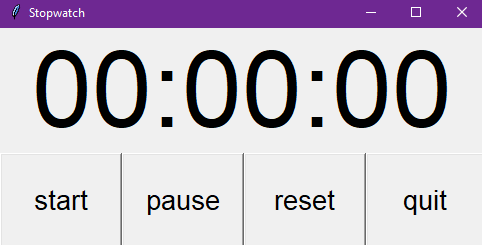

# GUI Stopwatch

[](https://github.com/your-username/notepad/blob/main/LICENSE)
[](https://www.python.org/downloads/)
[](https://docs.python.org/3/library/tkinter.html)

This is a simple GUI stopwatch program written in Python using the Tkinter library.



> Make Sure to ⭐ the Repo if You liked it -- It Helps!

## Features

- **Start:** Begins the stopwatch timer.
- **Pause:** Pauses the timer at its current value.
- **Reset:** Resets the timer to 0.

## Requirements

- Python 3.x
- Tkinter library (usually comes pre-installed with Python)

## How to Run

1. Make sure you have Python installed on your system.
2. Clone this repository or download the `main.py` file.
3. Open a terminal or command prompt and navigate to the directory where the `main.py` file is located.
4. Run the following command to start the stopwatch:

    ```bash
    python main.py
    ```

5. The GUI window will appear with the stopwatch interface.
6. Click the "**Start**" button to start the stopwatch. Click "**Pause**" to pause the timer at its current value, and "**Reset**" to reset the timer to 0.

## Contributing

Contributions are welcome! If you have any suggestions, improvements, or bug fixes, feel free to submit a pull request.

## License

This project is licensed under the [MIT License]. Feel free to use and modify the code as per your needs.

## Author

Created by: 

## Acknowledgements

- The GUI interface is built using the Tkinter library, which is a standard Python interface to the Tk GUI toolkit.
- This program is a part of my **"100 Days, 100 Programs"** challenge.

---

Made with ❤️ in Frence


