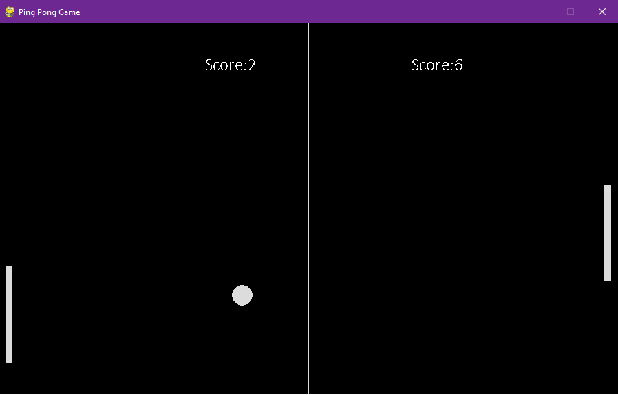

# Ping Pong Game

[](https://www.python.org)
[](https://www.pygame.org)
[](LICENSE)

A simple ping pong game implemented in Python using the Pygame library.



> Make Sure to ⭐ the Repo if You liked it -- It Helps!

## Features

- Play the classic ping pong game right on your computer.
- Control your paddle using the arrow keys.
- Compete against the computer AI and try to score as many points as possible.
- Enjoy smooth gameplay and responsive controls.

## Installation

1. Make sure you have Python 3.6 or above installed on your system. You can download the latest version of Python from the [official website](https://www.python.org/downloads/).

2. Install the Pygame library by running the following command:

   ```shell
   pip install pygame
   ```

## Usage

Run the script by executing the following command:
```shell
python main.py
```

Use the arrow keys to control the player's paddle. The objective is to prevent the ball from hitting the boundary behind your paddle while trying to make the ball pass the opponent's paddle.

## License

This project is licensed under the MIT License. For more information, see the [LICENSE] file.

## Author

Created by: 

## Acknowledgments

- **Pygame** - A Python library for creating games
- This program is a part of my **"100 Days, 100 Programs"** challenge.

---

Made with ❤️ in Frence

